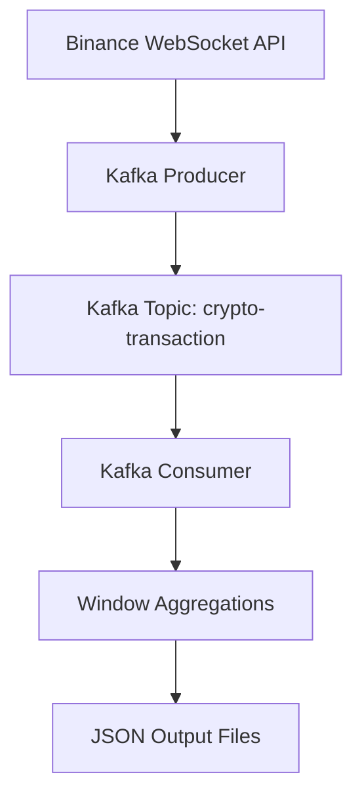

# Real-Time Cryptocurrency Streaming Pipeline with Kafka

This project implements a real-time streaming data pipeline using Kafka, Docker, and Python.

Cryptocurrency trade events are ingested from the Binance WebSocket API, streamed through Kafka topics, processed with windowed aggregations, and persisted as JSON outputs.

---

## Architecture



---

## Tech Stack

* Python
* Apache Kafka
* Docker & Docker Compose
* Binance WebSocket API
* kafka-python
* Real-time streaming
* Windowed event processing

---

## Features

* Real-time cryptocurrency trade ingestion
* Kafka-based event streaming
* Dockerized distributed architecture
* Windowed aggregations
* JSON persistence layer
* Graceful shutdown handling
* Consumer group processing
* Fault-tolerant container restart

---

## Project Structure

```text
.
├── producer.py
├── consumer.py
├── output/
├── docker-compose.yml
├── Dockerfile
├── requirements.txt
└── README.md
```

---

## How to Run

### Clone repository

```bash
git clone https://github.com/Smonsalve09/Streaming-Pipeline-Kafka.git
cd Streaming-Pipeline-Kafka
```

### Start services

```bash
docker compose up --build
```

---

## Open Kafka UI

Kafka UI is available at:

```text
http://localhost:8080
```

---

## Example Output

```json
{
  "timestamp": "2026-05-06T22:48:10",
  "window_seconds": 10,
  "aggregations": {
    "BTCUSDT": {
      "avg_price": 81302.14,
      "min_price": 81295.10,
      "max_price": 81310.50,
      "event_count": 245
    }
  }
}
```

---

## Future Improvements

* Spark Structured Streaming integration
* Delta Lake storage
* Medallion Architecture
* Real-time dashboards
* Schema Registry
* Dead-letter queue implementation
* Exactly-once semantics
* Kubernetes deployment

---

## Screenshots


